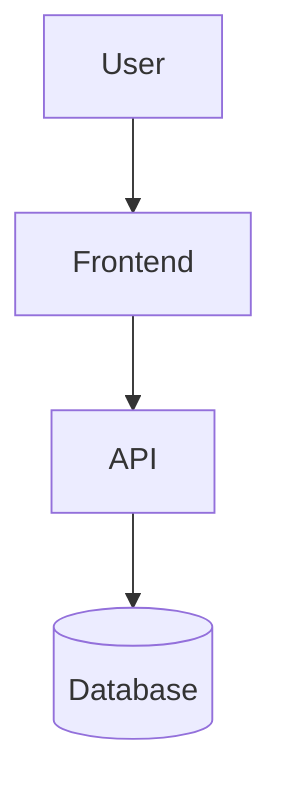
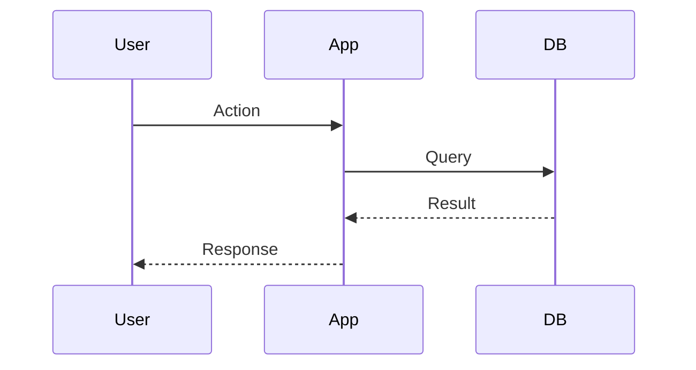

# Architecture: [Project Name]

**Last mapped:** [timestamp]

## Stack

| Layer | Technology |
|-------|-----------|
| Language | [e.g., TypeScript] |
| Framework | [e.g., Next.js 14] |
| Database | [e.g., PostgreSQL via Prisma] |
| Deployment | [e.g., Vercel] |

## System Overview

## Services

### [Service Name]
- **Type:** [API / Frontend / Worker / etc.]
- **Entry:** `path/to/entry.ts`
- **Port:** [port if applicable]
- **Key directories:**
  - `src/routes/` — API endpoints
  - `src/models/` — Data models
  - `src/middleware/` — Request middleware

## Third-Party Integrations

| Provider | Category | Used In | Env Vars |
|----------|----------|---------|----------|
| [Provider] | [Payments/Auth/Email/etc.] | `src/services/provider.ts` | `PROVIDER_KEY` |

## Data Flow

## Key Patterns
- **[Pattern]** — [What it is, where it's used]

## Environment Variables

| Variable | Purpose | Required |
|----------|---------|----------|
| `DATABASE_URL` | Database connection | Yes |

---
*Mapped by PM Assistant. Run `/pm:map --regen` to update.*
