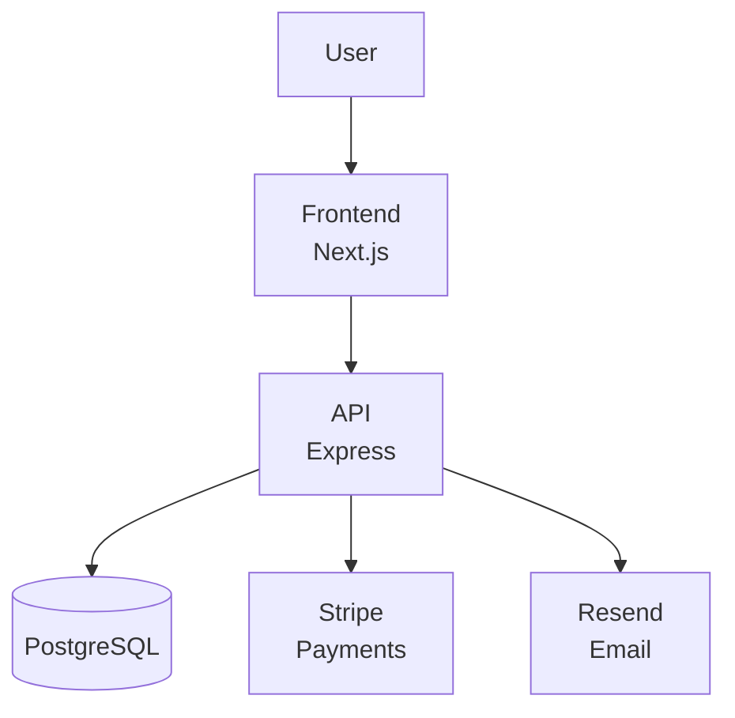
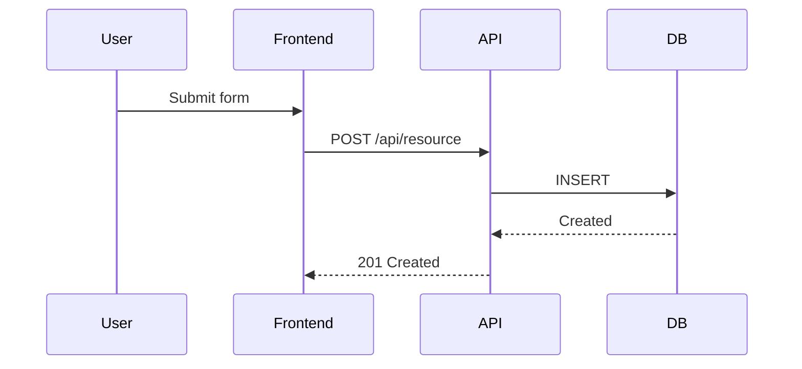
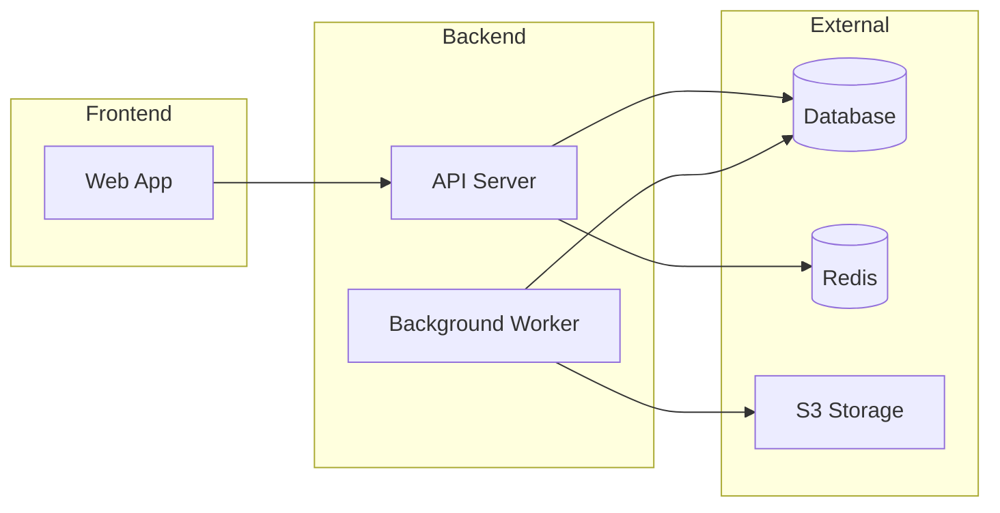

# Workflow: Map

## 1. Validate Prerequisites

Check that source code exists:
```bash
find . -name "*.ts" -o -name "*.tsx" -o -name "*.js" -o -name "*.jsx" -o -name "*.py" -o -name "*.go" -o -name "*.rs" -o -name "*.java" -o -name "*.rb" -o -name "*.swift" | head -1
```

**If no source files found:**
```
Error: No code to analyze. Build something first.
```
Exit.

**If `--regen` not passed and `.pm/ARCHITECTURE.md` exists:**
```
Architecture docs exist. Use /pm:map --regen to regenerate from scratch.
```
Exit.

## 2. Load Context

**Display banner:**
```
━━━━━━━━━━━━━━━━━━━━━━━━━━━━━━━━━━━━━━━━
 PM ► ARCHITECTURE MAP
━━━━━━━━━━━━━━━━━━━━━━━━━━━━━━━━━━━━━━━━
```

Read `.pm/PROJECT.md` if it exists — for project name, stack info.

## 3. Detect Stack

Scan for framework and language indicators:

**Package manifests:**
- `package.json` → Node.js ecosystem. Parse `dependencies` and `devDependencies`.
- `requirements.txt` / `pyproject.toml` → Python ecosystem.
- `go.mod` → Go.
- `Cargo.toml` → Rust.
- `Gemfile` → Ruby.
- `Package.swift` → Swift.

**Frameworks (from dependencies):**
- Next.js, Express, Fastify, Hono, NestJS, Django, Flask, FastAPI, Rails, Gin, Actix, etc.

**Databases (from dependencies + config):**
- Prisma, Drizzle, TypeORM, Sequelize → SQL (identify which: PostgreSQL, MySQL, SQLite)
- Mongoose, MongoDB driver → MongoDB
- Redis, ioredis → Redis
- Look for connection strings in `.env.example` or config files

**Record:** Framework, language, database, runtime.

## 4. Map Service Boundaries

### 4a. Identify Services
Look for service separation patterns:

**Monolith signals:**
- Single `src/` directory with one entry point
- One `package.json` at root

**Multi-service signals:**
- Multiple `package.json` files (monorepo)
- Directories like `frontend/`, `backend/`, `api/`, `web/`, `worker/`, `services/`
- Docker compose with multiple services
- Separate deployment configs

**For each service found, document:**
- Name (inferred from directory or config)
- Type (API, web frontend, worker, database, cache)
- Entry point
- Port (if applicable)

### 4b. Map Internal Structure
For each service, identify:
- **Routes / Endpoints** — grep for route definitions
- **Models / Schema** — find data model files
- **Controllers / Handlers** — find request handlers
- **Middleware** — find middleware chains
- **Utils / Helpers** — find shared utilities

## 5. Detect Third-Party Integrations

Search for third-party service usage:

| Provider | Grep For | Category |
|----------|----------|----------|
| Stripe | `stripe`, `STRIPE_` | Payments |
| Auth0 | `auth0`, `AUTH0_` | Auth |
| Clerk | `@clerk`, `CLERK_` | Auth |
| Supabase | `supabase`, `SUPABASE_` | BaaS |
| Firebase | `firebase`, `FIREBASE_` | BaaS |
| AWS S3 | `aws-sdk`, `S3`, `AWS_` | Storage |
| Cloudinary | `cloudinary`, `CLOUDINARY_` | Media |
| SendGrid | `sendgrid`, `SENDGRID_` | Email |
| Resend | `resend`, `RESEND_` | Email |
| PostHog | `posthog`, `POSTHOG_` | Analytics |
| Sentry | `@sentry`, `SENTRY_` | Error tracking |
| Axiom | `axiom`, `AXIOM_` | Logging |
| Vercel | `vercel.json`, `VERCEL_` | Deployment |
| Railway | `railway.toml` | Deployment |
| Render | `render.yaml` | Deployment |
| Docker | `Dockerfile`, `docker-compose` | Deployment |

**For each integration found:**
- Provider name
- Category
- Where it's used (file paths)
- Whether env vars are documented in `.env.example`

## 6. Map Data Flow

Trace how data moves through the system:

1. **User input** → Where does user data enter? (forms, API calls)
2. **Processing** → What transforms or validates the data? (middleware, handlers)
3. **Storage** → Where is data persisted? (database, file system, cache)
4. **Output** → What does the user see? (HTML, JSON, files)

Look for:
- API client configurations (base URLs, interceptors)
- Database queries and ORM calls
- Message queue producers/consumers
- WebSocket connections
- Cron jobs / scheduled tasks

## 7. Detect Deployment Topology

Check for deployment configuration:
- `Dockerfile` / `docker-compose.yml` → Containerized
- `vercel.json` → Vercel
- `render.yaml` → Render
- `fly.toml` → Fly.io
- `railway.toml` → Railway
- `.github/workflows/deploy.yml` → CI/CD pipeline
- `terraform/` → Infrastructure as code
- `serverless.yml` → Serverless

## 8. Generate ARCHITECTURE.md

Write `.pm/ARCHITECTURE.md` using `@~/.claude/ship-pm/templates/architecture.md`.

**Include mermaid diagrams:**

### System Overview Diagram


Adapt the diagram to match what was actually found. Only include real components, not hypothetical ones.

### Data Flow Diagram (if complex enough)


### Service Boundary Diagram (if multi-service)


## 9. Done

Display:
```
━━━━━━━━━━━━━━━━━━━━━━━━━━━━━━━━━━━━━━━━
 PM ► ARCHITECTURE MAPPED
━━━━━━━━━━━━━━━━━━━━━━━━━━━━━━━━━━━━━━━━

 Stack: [framework] + [database]
 Services: [count]
 Integrations: [count] third-party
 Deployment: [platform]

 Written: .pm/ARCHITECTURE.md

 Next: Run /pm:sync to update all PM state.
```
